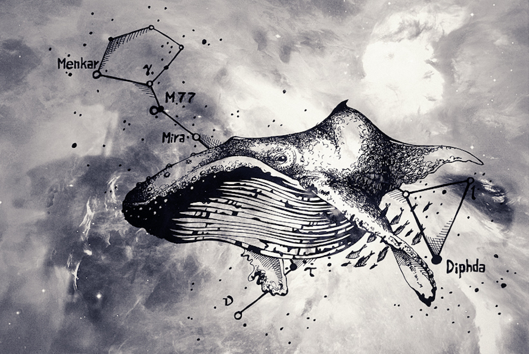

# Baleen
**An automated ingestion service for blogs to construct a corpus for NLP research.**

[![Build Status][travis_img]][travis_href]
[![Coverage Status][coveralls_img]][coverals_href]
[![Documentation Status][rtfd_img]][rtfd_href]
[![Stories in Ready][waffle_img]][waffle_href]

[][spacewhale.jpg]

## Quick Start

This quick start is intended to get you setup with Baleen in development mode (since the project is still under development). If you'd like to run Baleen in production, please see the [documentation][rtfd_href].

1. Clone the repository

    ```
$ git clone git@github.com:bbengfort/baleen.git
$ cd baleen
    ```

2. Create a virtualenv and install the dependencies

    ```
$ virtualenv venv
$ source venv/bin/activate
$ pip install -r requirements.txt
    ```

3. Add the `baleen` module to your `$PYTHONPATH` via the virtualenv.

    ```
$ echo $(pwd) > venv/lib/python2.7/site-packages/baleen.pth
    ```

4. Create your local configuration file. Edit it with the connection details to your local MongoDB server.  This is also a good time to check and make sure that you can create a database called Baleen on Mongo.

    ```
$ cp conf/baleen-example.yaml conf/baleen.yaml
    ```

    ```yaml
debug: true
testing: false
database:
    host: localhost
    port: 27017
    name: baleen
    ```

5. Run the tests to make sure everything is ok.

    ```
$ make test
    ```

6. Make sure that the command line utility is ready to go:

    ```
$ bin/baleen --help
    ```

7. Import the feeds from the `feedly.opml` file in the fixtures.

    ```
$ bin/baleen import fixtures/feedly.opml
Ingested 101 feeds from 1 OPML files
    ```

8. Perform an ingestion of the feeds that were imported from the `feedly.opml` file.

    ```
$ bin/baleen ingest
    ```

Your Mongo database collections should be created as you add new documents to them, and at this point you're ready to develop!

## About

Baleen is a tool for ingesting _formal_ natural language data from the discourse of professional and amateur writers: e.g. bloggers and news outlets. Rather than performing web scraping, Baleen focuses on data ingestion through the use of RSS feeds. It performs as much raw data collection as it can, saving data into a Mongo document store.

### Throughput

[](https://waffle.io/bbengfort/baleen/metrics)

### Attribution

The image used in this README, ["Space Whale"][spacewhale.jpg] by [hbitik](http://hbitik.deviantart.com/) is licensed under [CC BY-NC-ND 3.0](http://creativecommons.org/licenses/by-nc-nd/3.0/)


<!-- References -->
[travis_img]: https://travis-ci.org/bbengfort/baleen.svg?branch=master
[travis_href]: https://travis-ci.org/bbengfort/baleen/
[coveralls_img]: https://coveralls.io/repos/github/bbengfort/baleen/badge.svg?branch=master
[coverals_href]: https://coveralls.io/github/bbengfort/baleen?branch=master
[waffle_img]: https://badge.waffle.io/bbengfort/baleen.png?label=ready&title=Ready
[waffle_href]: https://waffle.io/bbengfort/baleen
[rtfd_img]: https://readthedocs.org/projects/baleen-ingest/badge/?version=latest
[rtfd_href]: http://baleen-ingest.readthedocs.org/
[spacewhale.jpg]: http://fav.me/d4736q3
